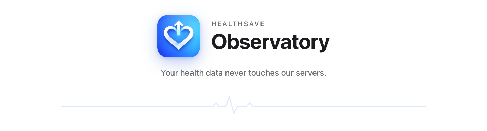
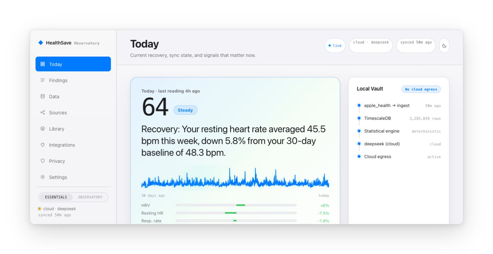
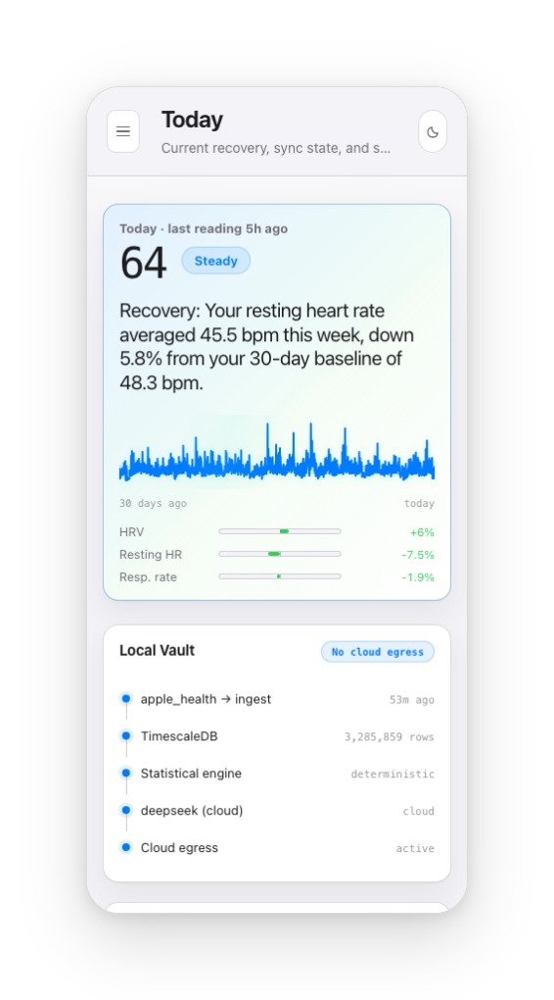
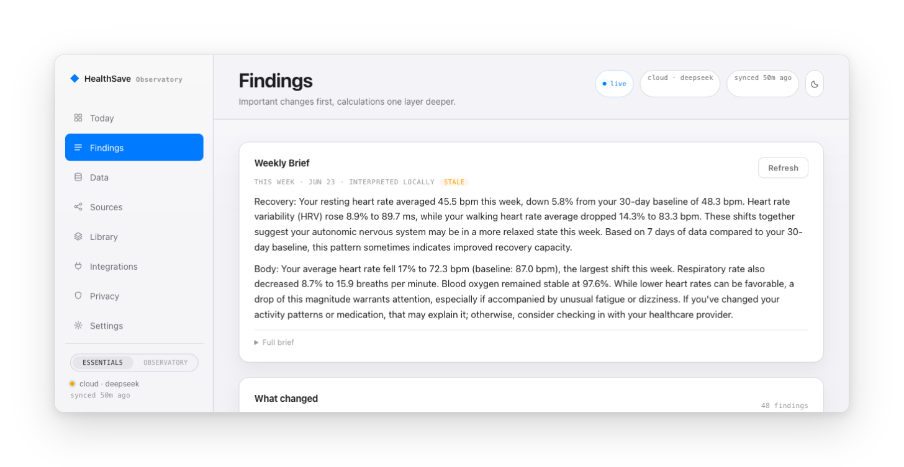
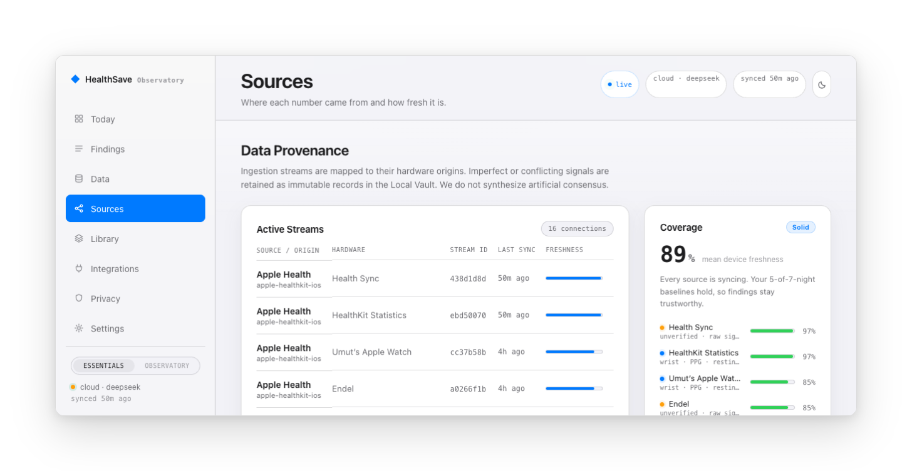
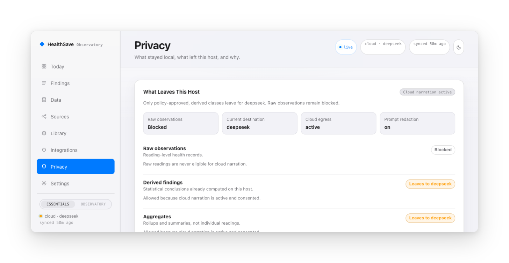
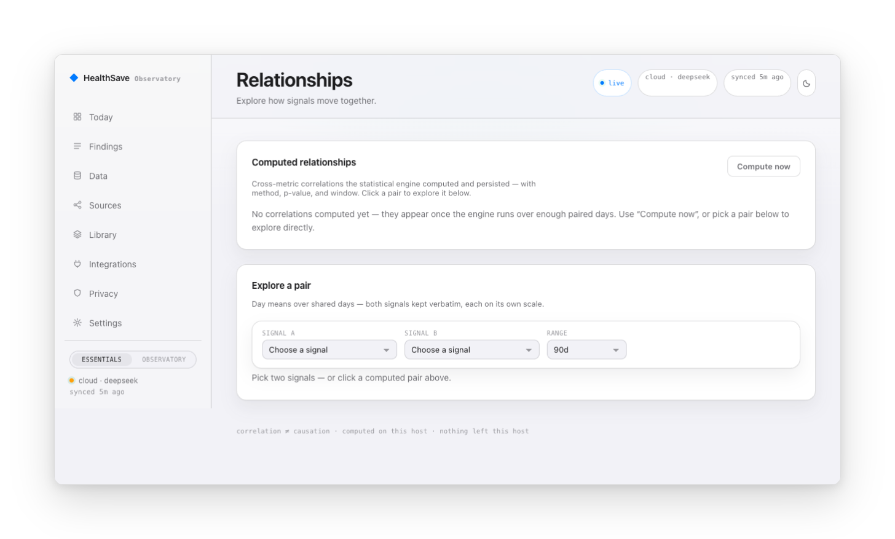
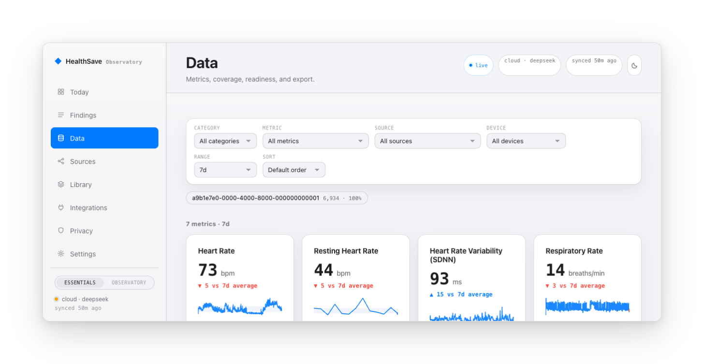

<p align="center">
  <picture>
    <source media="(prefers-color-scheme: dark)" srcset="docs/assets/github/hero-dark.png">
    
  </picture>
</p>

<p align="center">
  <a href="https://github.com/umutkeltek/healthsave-observatory/actions/workflows/ci.yml"></a>
  <a href="LICENSE"></a>
  <a href="https://www.python.org/downloads/"></a>
  <a href="https://fastapi.tiangolo.com/"></a>
  <a href="https://www.docker.com/"></a>
  <a href="https://apps.apple.com/app/id6759843047"></a>
</p>

HealthSave Observatory is the self-hosted backend for HealthSave. The iOS app can export and sync Apple Health data; Observatory gives that data a private server, web surface, Grafana dashboards, API, optional local AI briefings, and Home Assistant/MQTT routes.

Raw observations stay on hardware you control unless you enable an egress route.

## See it in action

One crisp clip, zero marketing fluff — the real product talking to a real local vault. Rendered at native **1920×1080** with a locally-synthesised neural voiceover (no cloud TTS, no stock footage): every pixel is the live dashboard rebuilt in vector, so it stays sharp at any size.

<p align="center">
  <video src="docs/assets/observatory-showcase.mp4" controls poster="docs/assets/poster-showcase.jpg" preload="metadata" width="100%"></video>
</p>

<sub>[▶ Open the narrated showcase (33s, 1080p)](docs/assets/observatory-showcase.mp4) if the player above doesn't load.</sub>

### Product tour — the three screens that matter

**Today.** A live nervous-load score, the week's recovery narrative, and the Local Vault panel that proves where every number lives. The vault below holds **3,285,859 rows** in a self-hosted TimescaleDB — the *No cloud egress* badge is the point.

<p align="center">
  
  &nbsp;&nbsp;
  
</p>

**Findings.** Statistics compute anomalies, trends and correlations; the local AI *narrates* them on Ollama and is badged **Interpreted locally** — it summarises real measurements, it never invents a health fact. The weekly brief below cites resting HR 45.5 bpm (↓5.8%), HRV 89.7 ms (↑8.9%), walking HR 83.3 bpm (↓14.3%), SpO₂ stable at 97.6%.

<p align="center"></p>

**Sources.** Every stream is mapped to its hardware origin with a freshness score — imperfect or conflicting signals are kept as immutable records, never averaged into a fake consensus.

<p align="center"></p>

<details>
<summary><strong>More surfaces</strong> — privacy posture, signal relationships, raw data explorer</summary>

| Privacy & egress | Relationships | Data explorer |
|:---:|:---:|:---:|
|  |  |  |

</details>

### By the numbers — pulled from a live demo vault + the repo

| Signal | Value | Where it comes from |
|---|---|---|
| Live vault size | **3,285,859 rows** | Today → Local Vault (self-hosted TimescaleDB) |
| Nervous-load score | **64 — Steady** | Today |
| Weekly recovery | resting HR **45.5 bpm** (↓5.8%), HRV **89.7 ms** (↑8.9%) | Findings → Weekly Brief |
| Source connections | **16**, **89%** mean device freshness | Sources → Data Provenance |
| Evidence-linked findings | **48** this week | Findings → What changed |
| Local AI | on-device narration, raw rows never leave | Findings → *Interpreted locally* |
| Automated tests | **1,298** | `pytest` suite |
| API routes | **60** | FastAPI app |
| Source connectors | **5+** — Whoop, Amazfit, Polar, Google Health, Apple Health | `plugins/sources/` |
| Codebase | **~66.7k** lines of Python | repo |
| License | **Elastic 2.0 — source-available** (not OSI open-source) | `LICENSE` |

## Quick Install

If Node.js is already available:

```bash
npm i -g healthsave
healthsave onboard
```

No global install:

```bash
npx healthsave
```

Server or clean-machine installer. Docker Compose v2 still needs to be installed and running:

```bash
curl -fsSL https://raw.githubusercontent.com/umutkeltek/healthsave-observatory/main/install.sh | bash
```

Windows PowerShell, using WSL2:

```powershell
irm https://raw.githubusercontent.com/umutkeltek/healthsave-observatory/main/install.ps1 | iex
```

Windows support uses WSL2 today. Install Docker Desktop, enable WSL integration for your Linux distro, then run the PowerShell handoff or the Unix command inside WSL2.

## Guided CLI

`healthsave onboard` opens the guided control center with arrow-key navigation:

- Basic setup and Advanced setup.
- Stack start/stop and optional layer toggles.
- Doctor/status checks, logs, and verification.
- CLI install and uninstall helpers.

Basic setup is the recommended first run. Advanced setup lets you choose passwords, API key, local AI/Ollama, model, and optional layers.

## What You Get

- **Capture without a new silo.** HealthSave iOS syncs Apple Health data into your server. Early Whoop and Amazfit plugins plus Garmin/Samsung importers follow the same canonical model. Android Health Connect and generic HMAC-signed ingest are planned.
- **One record you own.** Source / Device / Stream identity keeps integrations, physical devices, and metric streams separate without fragmenting your history.
- **Two surfaces.** Observatory web is the product surface for daily use. Grafana stays bundled for raw SQL-backed dashboards and builder workflows.
- **Evidence-linked findings.** Statistics compute anomalies, trends, summaries, and correlations. Local AI can narrate those findings, but it does not invent health facts.
- **Private routes.** Scripts, notebooks, agents, Home Assistant, MQTT, and exports can consume selected signals under your policy.

## Layers

```text
Capture sources
  HealthSave iOS / Apple Health
  Wearable plugins and importers
  Planned Health Connect and generic ingest

Core stack
  FastAPI API -> TimescaleDB -> worker findings

Surfaces and routes
  Observatory web
  Grafana
  Private API / CLI / agents
  Home Assistant / MQTT / export
```

## Connect HealthSave iOS

1. Open [HealthSave](https://apps.apple.com/app/id6759843047) on iPhone.
2. Go to Settings -> Server Sync.
3. Set Server URL to the LAN URL printed by `healthsave doctor`, for example `http://<server-lan-ip>:8000`.
4. Set the API key if you configured one.
5. Tap **Sync New Data**.

Do not use `localhost` from the phone. `localhost` would point at the phone itself. The iOS app sends Apple Health data through the frozen v1 ingest contract: `POST /api/apple/batch`.

HealthSave iOS also works without Observatory: on-device dashboard, trends, and CSV/JSON/PDF export do not need an account or a cloud server.

## Automation

Human setup should start with `healthsave onboard` or `npx healthsave`. Agents and CI should use named commands:

```bash
set -euo pipefail
healthsave setup basic --no-input
healthsave doctor --json
```

## Manual Checkout

```bash
git clone https://github.com/umutkeltek/healthsave-observatory.git
cd healthsave-observatory
./healthsave onboard
```

## CLI Lifecycle

- npm package name: `healthsave`
- global install path: `npm i -g healthsave`, then `healthsave onboard`
- no-install path: `npx healthsave`
- repo-local fallback: `./healthsave onboard`
- local wrapper install: `./healthsave install-cli`
- local wrapper uninstall: `./healthsave uninstall-cli`
- npm uninstall removes only the npm bootstrapper, not the checkout, containers, volumes, config, or health data
- Homebrew formula template: `packaging/homebrew/healthsave.rb.template`

## Compatibility

HealthSave Observatory runs on macOS, Linux, and WSL2 with Docker Compose v2. Native Windows install is a WSL2 handoff for now. Termux is not supported because the stack requires Docker Compose.

## Documentation

- [Overview](docs/overview.md) - product layers, data flow, and what ships today.
- [Zero To Ready](docs/zero-to-ready.md) - clean-machine path from install to synced iOS data.
- [Quick Start](docs/quick-start.md) - short setup path and health checks.
- [Connect HealthSave](docs/connect-healthsave.md) - pair the iOS app with the self-hosted backend.
- [Capture sources](docs/capture/index.md) - Apple Health, plugins, importers, and planned ingest paths.
- [Observatory web](docs/surfaces/observatory-web.md) - primary daily-use product surface.
- [Grafana](docs/surfaces/grafana.md) - bundled SQL-backed power-user dashboard.
- [Web vs Grafana](docs/surfaces/web-vs-grafana.md) - product surface versus raw dashboard boundary.
- [Home Assistant & MQTT](docs/integrations/home-assistant.md) - bridge HealthSave signals into Home Assistant.
- [API](docs/api/index.md) - stable ingest and evolving read/query APIs.
- [Deployment](docs/operations/deployment.md) - run on a laptop, VM, NAS, Proxmox VM, or homelab box.
- [CLI distribution](docs/operations/cli-distribution.md) - npm/npx, installers, repo-local launcher, and Homebrew release shape.
- [Development](docs/development/dev-setup.md) - local development and verification.

## License

HealthSave Observatory core is source-available under Elastic License 2.0. Protocol and SDK components may carry separate Apache-2.0 licensing where noted.
